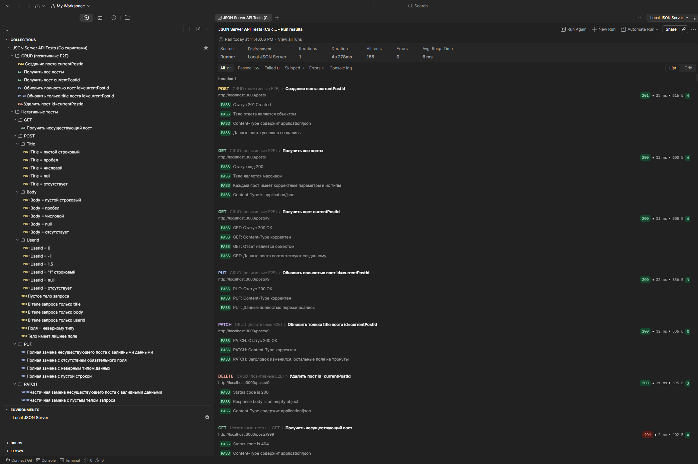
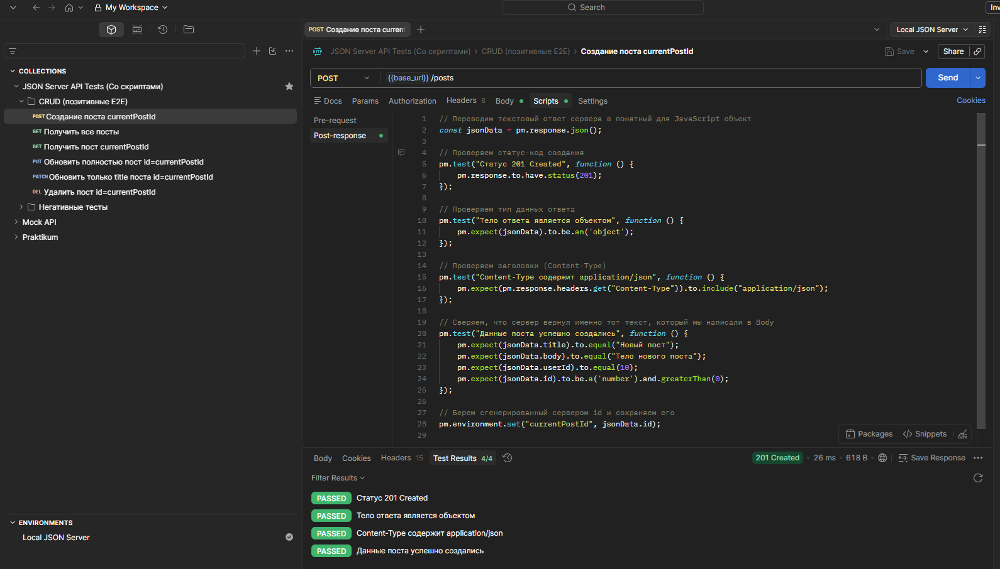

# Тестирование REST API: кастомная серверная валидация и автоматизация в Postman

## 🎯 Цель
Показать умение проектировать тесты API: позитивные/негативные сценарии CRUD, автоматические проверки в Postman, тестирование серверной валидации и документирование результатов.

## 📦 Что тестируем
REST API локального json-server, расширенного кастомной валидацией (`server.js`).  
**Сущность `Post`:**
| Поле    | Тип    | Обязательное | Доп. ограничения              |
|---------|--------|--------------|-------------------------------|
| id      | number | авто         | —                             |
| title   | string | да           | не пустая строка, не пробелы   |
| body    | string | да           | не пустая строка, не пробелы   |
| userId  | number | да           | целое, положительное           |

## 🧪 Особенности тест-дизайна
- **Полный E2E CRUD-сценарий**: POST → GET → PUT → PATCH → DELETE с передачей `id` через переменную окружения `currentPostId`
- **Изоляция данных**: каждый прогон создаёт новый пост и удаляет его в конце — никакого мусора
- **Проверка контракта ошибок**: все негативные тесты валидируют `message` и/или `errors` в теле ответа
- **Верификация Content-Type**: каждый позитивный тест проверяет `application/json; charset=utf-8`

## 📊 Покрытие (26 тестов)

| Метод  | Позитивные сценарии                | Негативные сценарии (примеры)                          | Всего |
|--------|------------------------------------|--------------------------------------------------------|-------|
| GET    | Все посты, пост по ID              | Несуществующий ID (404)                                | 3     |
| POST   | Создание валидного поста           | Пустое тело, отсутствие title/body/userId, неверные типы (число в title, строка в userId), null, пробелы | 16    |
| PUT    | Полное обновление                  | 404, отсутствие обязательных полей, невалидные данные   | 5     |
| PATCH  | Частичное обновление               | 404, пустой запрос, null, неверные типы                | 5     |
| DELETE | Удаление существующего             | Удаление несуществующего (404)                         | 2     |

### 🛡️ Матрица серверной валидации

| Поле    | Проверки                                                      |
|---------|---------------------------------------------------------------|
| title   | пустая строка, пробелы, число, null, отсутствие поля          |
| body    | пустая строка, пробелы, число, null, отсутствие поля          |
| userId  | 0, отрицательное, дробное, строка, null, отсутствие поля       |

## 🤖 Автоматические проверки (в каждом тесте)
`pm.test()` — статус-код, Content-Type, тело ответа (структура, типы, значения), сообщения об ошибках.

## 🐞 Найденные баги
| ID      | Описание                              | Серьёзность | Статус     |
|---------|---------------------------------------|-------------|------------|
| BUG-001 | id сохранялся как строка в db.json    | Medium      | Исправлено |
| BUG-002 | DELETE возвращает 200 вместо 204      | Minor       | Известная особенность json-server |

## 📂 Структура проекта
- [`server.js`](./server.js) — кастомный сервер с валидацией
- [`db.json`](./db.json) — тестовые данные (посты)
- [`package.json`](./package.json) — зависимости (json-server)
- [`JSON Server API Tests (Со скриптами).postman_collection.json`](./JSON%20Server%20API%20Tests%20(Со%20скриптами).postman_collection.json) — коллекция Postman с 26 тестами
- [`screenshots`](./screenshots) — скриншоты результатов

## 🖼️ Скриншоты

**Структура коллекции и успешный прогон Collection Runner**  


**Пример проверок в ответе POST /posts**  


## 🚀 Как запустить

```bash
git clone https://github.com/mnlghtzxc/qa-portfolio.git
cd qa-portfolio/projects/api-local-json-server
npm install
node server.js
```

- Импортируйте коллекцию в Postman и создайте окружение с переменной base_url = http://localhost:3000
