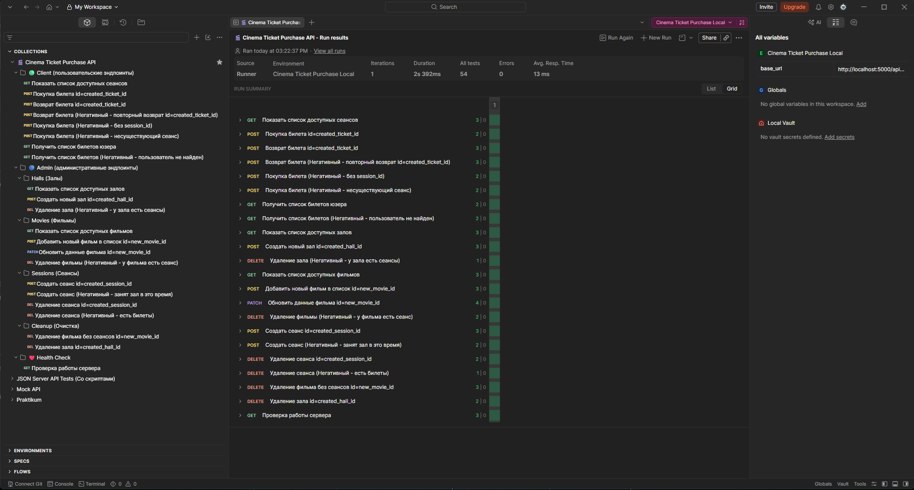
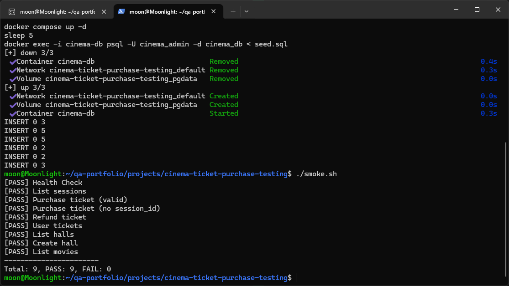
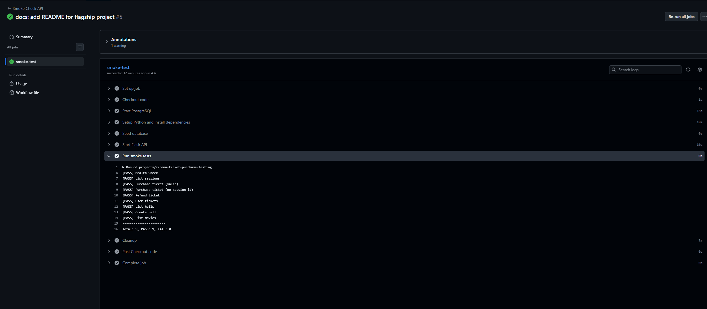
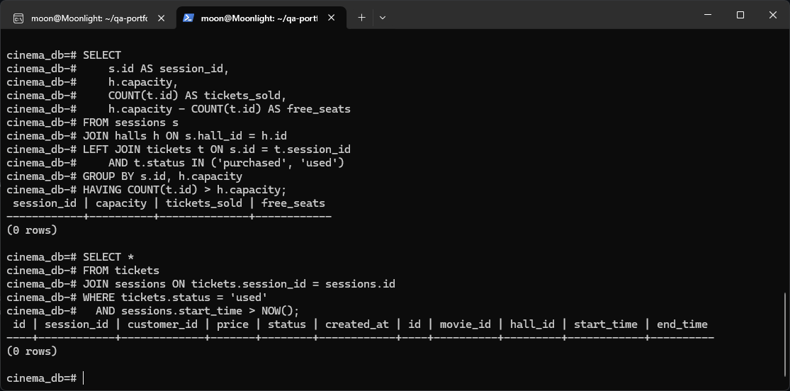

# 🎬 Интеграционный проект: Продажа билетов в кинотеатр (API + SQL + Docker + CI/CD)

## 🎯 Цель
Показать, как Manual QA Engineer с уклоном в API/Backend тестирует микросервис на всех уровнях: от проектирования тестовых данных и проверки контрактов API до контроля целостности базы данных и настройки непрерывной интеграции. Проект объединяет все ключевые инструменты, освоенные в предыдущих блоках обучения: Docker, PostgreSQL, SQL, REST API, Postman, curl, Git, CI/CD.

## 🧠 Ключевые навыки
- Ручное тестирование REST API (12 эндпоинтов) с проверкой статус‑кодов, контрактов и бизнес‑логики
- Проектирование структурированной коллекции Postman (21 запрос) с динамическими переменными и тестовыми скриптами
- Написание SQL‑запросов для проверки целостности данных после операций API
- Работа с PostgreSQL в Docker‑контейнере: инициализация схемы, загрузка тестовых данных
- Разработка smoke‑скрипта на bash для быстрой проверки работоспособности API
- Настройка CI/CD (GitHub Actions) для автоматического запуска smoke‑тестов при каждом push
- Анализ бизнес‑правил и оформление тестовой документации (тест‑кейсы, тестовая стратегия, наблюдения)
- Осознанное использование AI‑ассистента в роли backend‑разработчика с чётким разделением ответственности

## 🛠️ Инструменты
- **Python 3 + Flask** — REST API
- **PostgreSQL 16** — база данных
- **Docker + Docker Compose** — контейнеризация и управление тестовым окружением
- **Postman** — ручное тестирование и коллекция с тестами
- **Bash + curl** — smoke‑проверки из командной строки
- **Git + GitHub** — контроль версий и хостинг проекта
- **GitHub Actions** — CI/CD (автоматический прогон smoke‑тестов)
- **WSL2 / Ubuntu** — среда разработки и тестирования

## 📦 Описание проекта

**Сервис** управляет киносеансами, продажей и возвратом билетов.  
API разделено на клиентскую и административную части.

**Клиентские эндпоинты (4):**
- `GET /api/v1/sessions` — список сеансов с расчётом свободных мест
- `POST /api/v1/tickets/purchase` — покупка билета (с валидацией и транзакционной защитой от перепродажи)
- `POST /api/v1/tickets/{id}/refund` — возврат билета (только до начала сеанса)
- `GET /api/v1/users/{id}/tickets` — билеты зарегистрированного пользователя

**Административные эндпоинты (8):**
- CRUD залов: `GET/POST/DELETE /admin/halls`
- CRUD фильмов: `GET/POST/PATCH/DELETE /admin/movies`
- Управление сеансами: `POST/DELETE /admin/sessions` (с автоматическим расчётом времени и проверкой пересечений)

Все эндпоинты возвращают JSON, используют стандартные коды ответов (200, 201, 400, 404, 409, 500) и защищены от конкурентных запросов с помощью `SELECT ... FOR UPDATE`.

## 🧪 Сценарий для QA: как я тестирую API

1. **Smoke проверка**  
   Запускаю `./smoke.sh` — 9 критичных эндпоинтов проверяются за секунды. Вижу `[PASS]` или `[FAIL]`.

2. **Ручное тестирование в Postman**  
   Прогоняю коллекцию из 21 запроса: позитивные и негативные сценарии, проверка статусов, структуры JSON, типов данных. Использую динамические переменные для передачи ID между запросами.

3. **Проверка целостности данных (SQL)**  
   После прогона тестов выполняю запросы из `sql/checks.sql`: нет ли перепроданных билетов, использованных билетов на будущие сеансы, орфанных записей, нарушений уникальности email.

4. **Анализ бизнес‑логики**  
   Сверяю поведение системы с документированными правилами: цена копируется из зала, возврат невозможен после начала сеанса, удаление зала блокируется при наличии сеансов.

5. **CI/CD**  
   При каждом push в ветку `main` GitHub Actions автоматически поднимает Docker‑окружение, загружает тестовые данные и запускает `smoke.sh`. Если хоть одна проверка упадёт — я сразу вижу красный крестик в коммите.

## ⚠️ Честное признание (AI-ассистент в роли разработчика)
В этом проекте код приложения (`app.py`) и Docker‑окружения (`docker-compose.yml`) был написан AI‑ментором.  
Моя роль как QA‑инженера:
- участие в проектировании модели данных и обсуждение бизнес‑правил,
- создание коллекции Postman с тестами,
- ручное тестирование API с фиксацией результатов,
- написание SQL‑запросов для проверки целостности данных,
- разработка smoke‑скрипта и настройка CI/CD,
- оформление всей тестовой документации (тест‑кейсы, тест‑стратегия, наблюдения).

Код приложения я разобрал, понимаю его логику и могу объяснить на собеседовании. Такое разделение ответственности честно отражает реальную практику 2026 года, где AI‑инструменты активно используются разработчиками, а QA‑инженер фокусируется на обеспечении качества и тестировании.

## 📂 Структура проекта
- [`app.py`](./app.py) — код API (Flask)
- [`docker-compose.yml`](./docker-compose.yml) — Docker‑окружение (PostgreSQL)
- [`requirements.txt`](./requirements.txt) — Python‑зависимости
- [`schema.sql`](./schema.sql) — DDL (схема базы данных)
- [`seed.sql`](./seed.sql) — тестовые данные
- [`smoke.sh`](./smoke.sh) — smoke‑скрипт
- [`postman/`](./postman/) — коллекция Postman
- [`sql/checks.sql`](./sql/checks.sql) — SQL‑проверки целостности
- [`docs/API.md`](./docs/API.md) — документация API
- [`docs/Test-Cases.md`](./docs/Test-Cases.md) — ручные тест‑кейсы
- [`docs/Test-Strategy.md`](./docs/Test-Strategy.md) — тестовая стратегия
- [`docs/Observations.md`](./docs/Observations.md) — наблюдения и рекомендации
- [`.github/workflows/smoke.yml`](../.github/workflows/smoke.yml) — CI/CD (GitHub Actions)

## 🖼️ Скриншоты

*Коллекция Postman (21 тест) — все PASS*


*Smoke‑скрипт в терминале — 9/9 PASS*


*Workflow Smoke Check API — успешный прогон*


*Пример SQL‑проверки: пересечение сеансов (0 rows), Использованные билеты только на прошедших сеансах (0 rows)*

## 🚀 Как запустить

```bash
# 1. Клонировать репозиторий
git clone git@github.com:mnlghtzxc/qa-portfolio.git
cd qa-portfolio/projects/cinema-ticket-purchase-testing

# 2. Поднять PostgreSQL
docker compose up -d
sleep 5

# 3. Загрузить тестовые данные
docker exec -i cinema-db psql -U cinema_admin -d cinema_db < seed.sql

# 4. Установить зависимости Python
python3 -m venv venv
source venv/bin/activate
pip install -r requirements.txt

# 5. Запустить API
python3 app.py

# 6. Во втором терминале выполнить smoke‑тест
./smoke.sh
