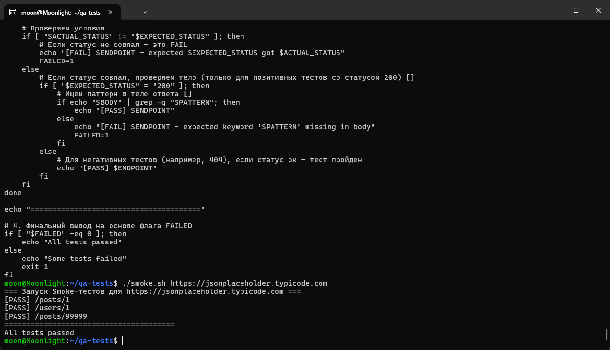

# Linux CLI для QA: автоматический smoke-тест API

## 🎯 Цель
Показать, как ручной тестировщик API/Backend может использовать командную строку Linux для быстрой проверки работоспособности основных эндпоинтов без Postman, фреймворков и графического интерфейса. Проект демонстрирует навыки работы с bash, curl и стандартными утилитами, достаточные для первичного анализа инцидентов и автоматизации рутинных проверок.

## 🧠 Ключевые навыки
- Навигация по файловой системе (`cd`, `ls`, `mkdir`, `touch`, `pwd`)
- Просмотр и фильтрация логов (`cat`, `head`, `tail`, `less`, `grep`, `wc`)
- Выполнение HTTP-запросов из терминала (`curl`) с анализом ответов
- Работа с HTTP-заголовками, статусами и телами ответов
- Использование пайпов (`|`) и условных операторов (`&&`, `||`)
- Обработка кодов возврата (`$?`, `-f`) для различения сетевых и HTTP-ошибок
- Написание и отладка bash-скриптов: переменные, массивы, условия, циклы
- Парсинг структурированного вывода (`cut`, `sed`, `grep`)

## 🛠️ Инструменты
- **WSL2 / Ubuntu** (Windows Subsystem for Linux)
- **Bash** (интерпретатор)
- **curl** (HTTP-клиент)
- **grep, cut, sed** (фильтрация и обработка текста)
- **JSONPlaceholder** (публичное тестовое API)

## 📦 Описание скрипта

Файл `smoke.sh` — это самодостаточный bash-скрипт, который эмулирует действия тестировщика при проверке «живости» API.

**Что делает скрипт:**
1. Принимает базовый URL как обязательный аргумент.
2. Проверяет, что URL передан (через `[ -z "$1" ]`).
3. Обходит массив эндпоинтов, для каждого из которых заданы:
   - путь (`/posts/1`, `/users/1`, `/posts/99999`),
   - ожидаемый HTTP-статус (`200` или `404`),
   - ключевое слово для проверки тела ответа (например, `"title"`, `"email"`).
4. Для каждого эндпоинта выполняет `curl`, извлекает фактический статус и тело ответа.
5. Сравнивает фактический статус с ожидаемым. Если ожидался `200`, дополнительно проверяет наличие ключевого слова в теле.
6. Выводит результат в формате `[PASS] <endpoint>` или `[FAIL] <endpoint> - expected X got Y`.
7. Возвращает `exit code 0` при успехе всех проверок и `exit code 1`, если хотя бы одна упала.

**Как это помогает QA:**
- Перед релизом за одну секунду убедиться, что критичные ручки отвечают.
- После деплоя на стейджинг быстро проверить, что ничего не сломалось.
- При расследовании инцидента — понять, проблема массовая или только на одном эндпоинте.
- Скрипт можно встроить в CI/CD (GitHub Actions) для автоматического запуска при каждом билде.

## 🧪 Сценарий для QA: как я проверяю API из консоли

1. **Быстрая проверка статуса**  
   `curl -s -o /dev/null -w '%{http_code}\n' https://api.example.com/health` — смотрю только код ответа, без тела.

2. **Проверка содержимого**  
   `curl -s https://api.example.com/users/1 | grep -q "email"` — убеждаюсь, что в ответе есть поле email.

3. **Smoke при деплое**  
   Запускаю `./smoke.sh https://api.example.com` и вижу сводку — все эндпоинты зелёные или есть падения.

4. **Анализ логов сервера**  
   `tail -f /var/log/nginx/error.log` — слежу за ошибками в реальном времени.  
   `grep "500" access.log | wc -l` — быстро считаю количество серверных ошибок за период.

5. **Отладка инцидента**  
   `curl -v https://api.example.com/problem-endpoint` — подробный лог запроса/ответа для поиска аномалий.

## ⚠️ Честное признание (learning in progress)
На момент создания этого проекта я **только знакомлюсь с написанием bash-скриптов в файлах**.  
Скрипт `smoke.sh` был написан с помощью ИИ, но **каждая строка разобрана и полностью мной понята**:  
- как работают массивы и циклы `for`,  
- как `cut` и `sed` извлекают части ответа,  
- как `grep -q` бесшумно проверяет наличие подстроки,  
- как `-z` защищает от запуска без аргументов.  

Этот проект — фиксация моей текущей точки роста: я умею пользоваться CLI для ручного тестирования API, а автоматизацию проверок осваиваю осознанно, не копируя «магию», а понимая механику.

## 📂 Структура проекта
- [`smoke.sh`](./smoke.sh) — исходный код скрипта
- [`screenshots/smoke-run.png`](./screenshots/smoke-run.png) — скриншот успешного прогона

## 🖼️ Скриншот


## 🚀 Как запустить
```bash
# Дать права на исполнение (один раз)
chmod +x smoke.sh

# Запустить проверку
./smoke.sh https://jsonplaceholder.typicode.com
