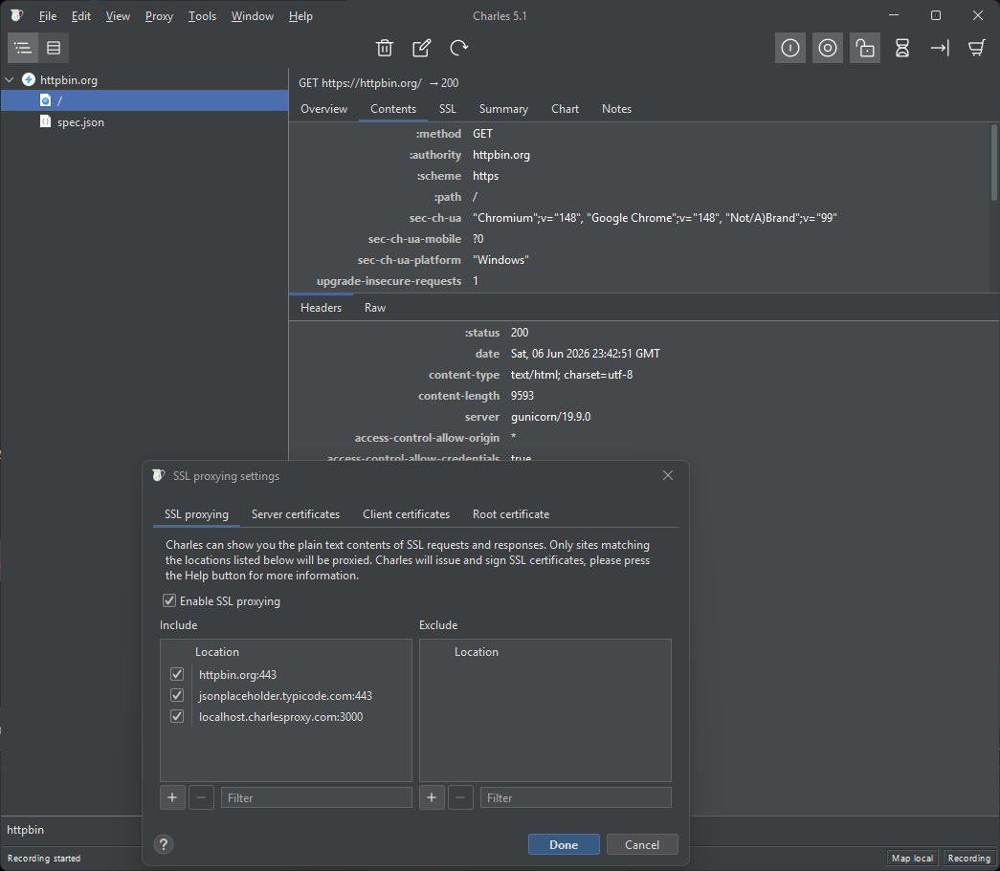
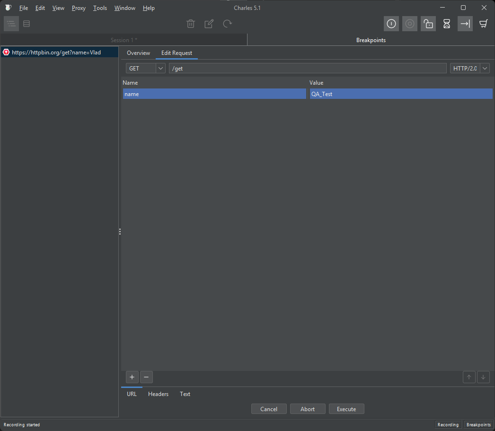
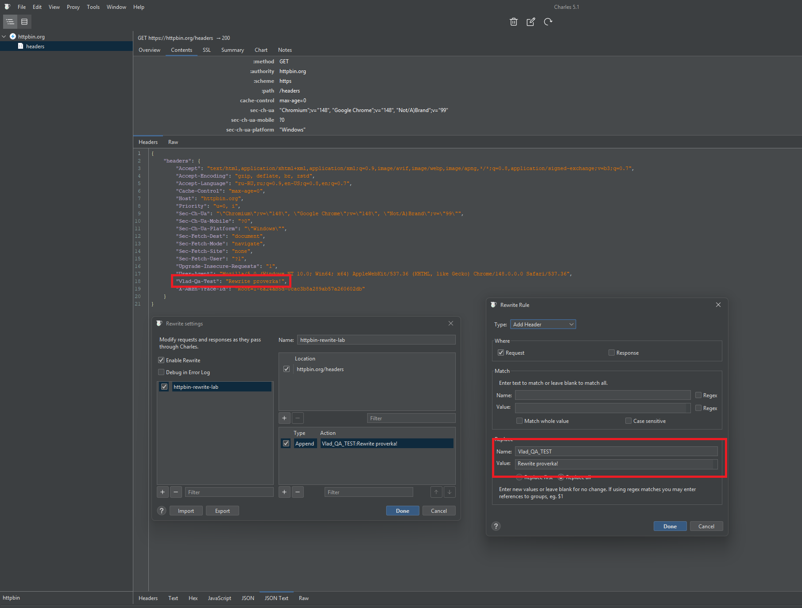
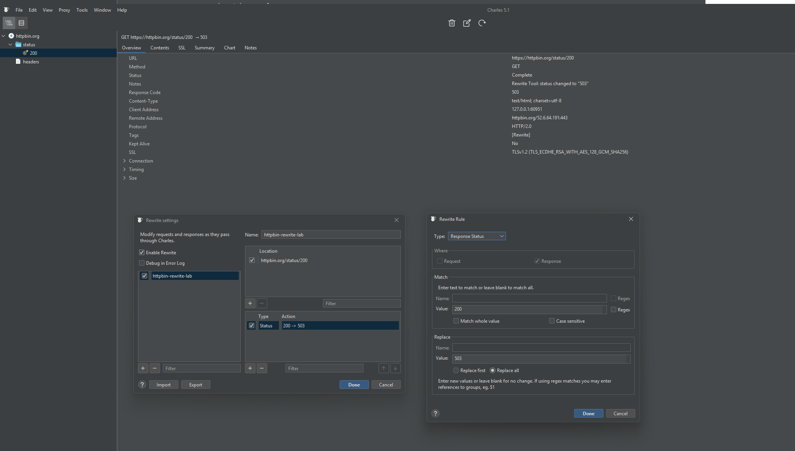
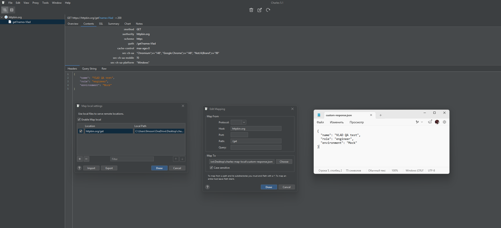

# Charles Proxy (модификация трафика)

## Цель

Проверка поведения системы при изменении HTTP-трафика и моделировании нестандартных/ошибочных сценариев.

---

## Выполненные сценарии

---

### SSL Proxying

Перехват и анализ HTTPS-трафика между клиентом и сервером.

**Результат:**
Успешно перехвачен зашифрованный HTTPS трафик, доступен для анализа в Charles Proxy.

**Скриншот:**

---

### Breakpoint

Изменение параметров запроса до отправки на сервер.

**Результат:**
Запрос перехвачен и изменён до отправки, параметры успешно модифицированы.

**Скриншот:**

---

### Rewrite Headers

Добавление кастомного заголовка:
- `X-QA-Test`

**Результат:**
API принял запрос с дополнительным заголовком, изменения зафиксированы в request headers.

**Скриншот:**

---

### Rewrite Status Code

Изменение ответа сервера:
- `200 OK` → `503 Service Unavailable`

**Результат:**
Смоделирована серверная ошибка, клиент получил статус 503.

**Скриншот:**

---

### Map Local

Подмена ответа сервера локальным JSON-файлом.

Используется для симуляции:
- недоступного API
- кастомного backend-ответа

**Результат:**
Ответ сервера успешно заменён локальным JSON.

**Скриншот:**

