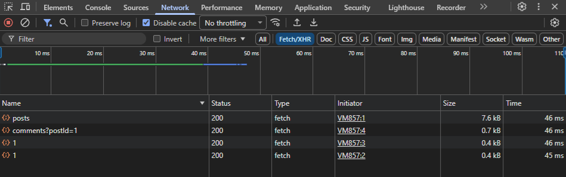
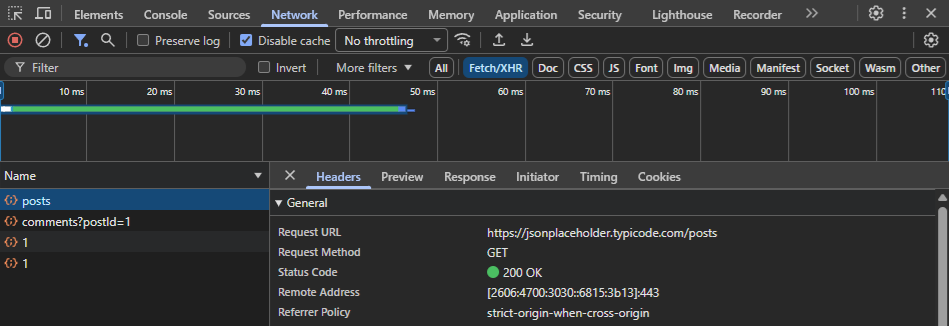
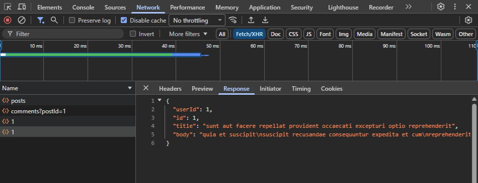

# 🔍 Анализ сетевого трафика в Chrome DevTools

## 🎯 Цель
Научиться читать и интерпретировать HTTP-запросы и ответы через вкладку Network, чтобы быстро локализовать дефекты — на стороне фронтенда, бэкенда или сети.

## 🧠 Ключевые навыки
- Фильтрация XHR/Fetch-запросов для изоляции API-вызовов
- Чтение URL, метода, статуса, заголовков и тела ответа
- Анализ заголовков кэширования (`cache-control`, `etag`, `cf-cache-status`)
- Различение успешных (2xx), клиентских (4xx) и серверных (5xx) ошибок
- Проверка структуры JSON-ответа на соответствие документации
- Экспорт и чтение HAR-файлов как доказательной базы

## 🛠️ Инструменты
- **Chrome DevTools** (вкладка Network)
- **Тестовое окружение:** JSONPlaceholder API

## 🧪 Выполненные запросы и анализ
В ходе анализа выполнены запросы к публичному API:
- `GET /posts` — получить список постов
- `GET /posts/1` — получить конкретный пост
- `GET /users/1` — получить пользователя
- `GET /comments?postId=1` — получить комментарии к посту

Для каждого запроса исследованы:
- **URL** и метод
- **Статус ответа** (200 OK)
- **Request headers** (авторизация, кэширование, CORS)
- **Response headers** (`content-type`, `cache-control`, `cf-cache-status`, `x-ratelimit-*`)
- **Тело ответа** (структура JSON, наличие ожидаемых полей)

### 📸 Общий вид вкладки Network

### 📸 Заголовки запроса

### 📸 Тело ответа

## 🔎 Как я применяю это в тестировании
1. **Локализация бага:** если пользователь видит пустой список, открываю Network → нахожу запрос списка → проверяю статус и тело. Если статус 200 и данные есть — баг на фронте. Если 500 — проблема на бэкенде.
2. **Проверка кэширования:** если данные не обновляются, смотрю заголовки `cache-control` и `age` — возможно, клиент отдаёт устаревший кэш.
3. **Анализ производительности:** по вкладке Network вижу долгие запросы, смотрю тайминги — проблема в сервере или в сети.
4. **Документирование инцидента:** экспортирую HAR-файл, чтобы приложить к баг-репорту и показать точный запрос/ответ.

## 📂 Артефакты
- [HAR-файл сессии](./session.har)

## 📌 Примечание
Этот документ фиксирует базовые навыки анализа трафика. В будущем я планирую дополнить его разбором реальных багов, найденных через DevTools, и более глубоким анализом заголовков.
