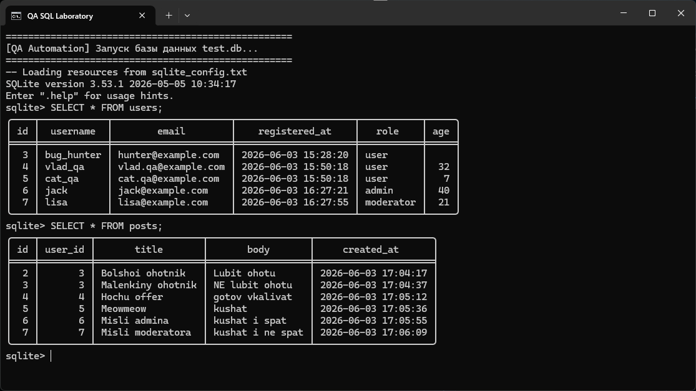
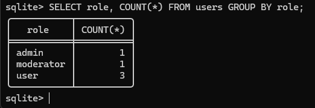
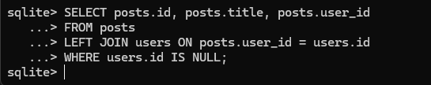
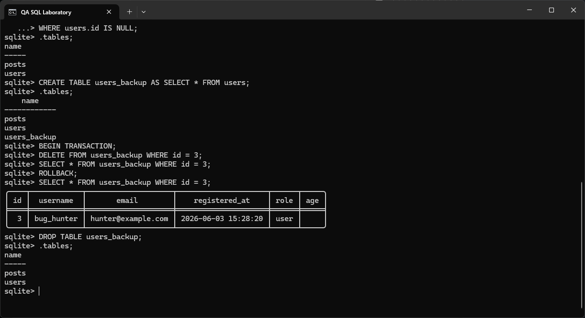
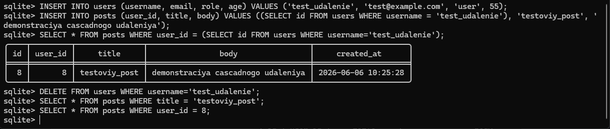

# SQL для QA: проверка целостности данных и анализ

## 🎯 Цель
Продемонстрировать навыки работы с реляционными базами данных через призму задач QA-инженера: проверка целостности, поиск аномалий, подготовка данных для расследования инцидентов.

## 🧠 Ключевые навыки
- Проектирование таблиц и ограничений (PRIMARY KEY, UNIQUE, NOT NULL, FOREIGN KEY)
- Написание запросов CRUD
- Фильтрация и поиск (WHERE, LIKE, AND/OR)
- Агрегация и группировка (GROUP BY, HAVING, COUNT, AVG)
- Объединения (INNER JOIN, LEFT JOIN)
- Поиск «битых» связей и орфанных записей
- Подзапросы (IN, EXISTS) и условная логика (CASE)
- Транзакции (BEGIN, COMMIT, ROLLBACK)

## 🛠️ Инструменты
- **SQLite 3** (консольный клиент)
- **Тестовое окружение:** локальная база данных `test.db`
- Конфигурация вывода задана в [`sqlite_config.txt`](./sqlite_config.txt)
- Все запросы собраны в [`queries.sql`](./queries.sql) с подробными комментариями

## 📦 Описание тестовой базы
База содержит две связанные таблицы:

**users** — пользователи сервиса  
| Поле | Тип | Ограничения |
|------|------|-------------|
| id | INTEGER | PRIMARY KEY AUTOINCREMENT |
| username | TEXT | NOT NULL |
| email | TEXT | UNIQUE NOT NULL |
| registered_at | DATETIME | DEFAULT CURRENT_TIMESTAMP |
| role | TEXT | NOT NULL DEFAULT 'user' |
| age | INTEGER | |

**posts** — посты пользователей  
| Поле | Тип | Ограничения |
|------|------|-------------|
| id | INTEGER | PRIMARY KEY AUTOINCREMENT |
| user_id | INTEGER | NOT NULL, FOREIGN KEY REFERENCES users(id) ON DELETE CASCADE |
| title | TEXT | NOT NULL |
| body | TEXT | |
| created_at | DATETIME | DEFAULT CURRENT_TIMESTAMP |

Связь `posts.user_id → users.id` настроена с каскадным удалением: при удалении пользователя его посты автоматически удаляются, что гарантирует целостность данных.

## 🧪 Как я применяю это в тестировании
1. **Проверка данных после API-запроса**
   - После выполнения POST-запроса на создание пользователя через API выполняю `SELECT * FROM users WHERE email = 'new@example.com';` чтобы убедиться, что запись появилась, поля заполнены корректно, дата регистрации проставлена.
   - После выполнения DELETE-запроса проверяю, что запись действительно удалена (`SELECT COUNT(*) FROM users WHERE id = ...`), а связанные посты удалены каскадно.

2. **Расследование инцидента**
   - Если пользователь жалуется на дублирование данных, ищу нарушение уникальности: `SELECT email, COUNT(*) FROM users GROUP BY email HAVING COUNT(*) > 1;`
   - Если данные выглядят неполными, ищу «орфанные» записи: `SELECT p.id, p.user_id FROM posts p LEFT JOIN users u ON p.user_id = u.id WHERE u.id IS NULL;`

3. **Регресс-проверки после миграции БД**
   - Проверяю, не потерялись ли связи: выполняю INNER JOIN ключевых таблиц и сравниваю количество записей.
   - Убеждаюсь, что новые ограничения работают корректно — например, FOREIGN KEY не даёт вставить запись с несуществующим user_id.

4. **Подготовка тестовых данных**
   - Наполняю базу тестовым набором через INSERT с подзапросами, чтобы гарантировать корректные связи.
   - Создаю резервные копии таблиц перед опасными операциями (`CREATE TABLE users_backup AS SELECT * FROM users;`).

## 📂 Структура проекта
- [`queries.sql`](./queries.sql) — полный набор запросов с комментариями
- [`sqlite_config.txt`](./sqlite_config.txt) — настройки отображения и поведения SQLite
- [`screenshots`](./screenshots) — скриншоты результатов ключевых запросов

## 🖼️ Скриншоты

### 📸 Вывод всех пользователей

### 📸 Группировка по ролям с подсчётом

### 📸 Поиск потерянных связей (LEFT JOIN + WHERE IS NULL)

### 📸 Демонстрация отката транзакции (ROLLBACK)

### 📸 Каскадное удаление поста при удалении пользователя

